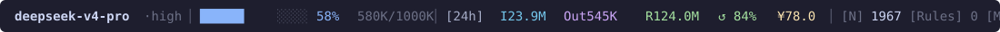

# Claude Code Statusline

A feature-rich custom status line for [Claude Code](https://claude.com/claude-code), showing multi-period token usage, cache hit-rate, and estimated cost at a glance.



```
deepseek-v4-pro·high │ █████▊░░░░ 58% 580K/1000K │ [24h] I23.9M Out545K R124.0M ↺ 84% ¥78.0 │ [N] 1967 [Rules] 0 [MCP] 1 │ user/project
```

## Features

| Group | What it shows |
|-------|---------------|
| **Model** | Model name + effort level (`·high`), current task label `▸ xxx [done/total]` |
| **Context** | 10-block usage bar + percent + `usedK/windowK` |
| **Usage** | Period-aggregated **I**nput (fresh) / **Out**put / cache-**R**ead tokens, cache hit-rate `↺ %`, estimated cost `¥` |
| **Session** | `[N]` turn count, `[Rules]` project rule files, `[MCP]` configured MCP servers |
| **Path** | Last 2 path segments, plus a `⟲` alarm when a tool loop is detected |

## Color legend

- 🔵 `I` — fresh (non-cached) input tokens
- 🟣 `Out` — output tokens
- 🟢 `R` — cache-read tokens (cache = savings)
- 🟢/🟡/🟠 `↺ %` — cache hit-rate, colored by threshold (≥80% green / ≥50% gold / else orange)
- 🟡 `¥` — estimated cost (cache pricing included)

## Why not just use CC's built-in numbers?

Claude Code's status line JSON exposes **per-turn** cache usage and cumulative **non-cached** input only — it does **not** expose cumulative cache-read tokens. This status line solves that by incrementally parsing the session transcript (`message.usage` per request) and caching byte offsets on disk, giving exact cumulative cache stats in O(1) per render even as the transcript grows.

## Installation

```bash
# 1. Copy the script
cp statusline.py ~/.claude/

# 2. Create the usage DB (apply schema.sql once)
mkdir -p ~/.claude-cost-tracker
sqlite3 ~/.claude-cost-tracker/usage.db < schema.sql

# 3. Configure the status line in ~/.claude/settings.json
#    (see settings.example.json)
"statusLine": {
  "type": "command",
  "command": "python3 ~/.claude/statusline.py"
}
```

## Configuration

### Pricing

Adjust `PRICING` at the top of `statusline.py` to match your provider's rates (¥ per 1M tokens):

```python
PRICING = {
    "deepseek-v4-pro":   {"in": 3.0, "cache": 0.025, "out": 6.0, "cur": "¥"},
    "deepseek-v4-flash": {"in": 1.0, "cache": 0.02,  "out": 2.0, "cur": "¥"},
    ...
}
```

The model is matched by substring after stripping `[Nk]/[Nm]` suffixes.

### Time period

The usage group defaults to the last 24h. Toggle between `24h / 7d / 30d / all` by writing the key to `~/.claude-cost-tracker/.period` (e.g. bind a key to run `echo 7d > ~/.claude-cost-tracker/.period`).

### Turn tip (optional)

If `~/.claude/tips/random_tip.py` exists, the terminal title is refreshed with a random tip every 45s.

## How it works

- `statusline.py` reads the JSON object CC pipes to it on **stdin**, renders one line, then writes it to **stdout**.
- Cumulative stats (tokens/cost per session) are persisted to `~/.claude-cost-tracker/usage.db` (throttled to 30s) via `_snapshot()`.
- The current session's numbers are always taken live from CC + the transcript, so nothing looks stale mid-conversation.
- All file paths use `~` — no absolute user paths are hardcoded.

## Security

- No API keys or credentials live in this script.
- `settings.example.json` shows the settings file with **placeholder** values — copy it and fill in your own.
- The script never reads or writes anything outside `~/.claude` / `~/.claude-cost-tracker`.

## License

MIT
